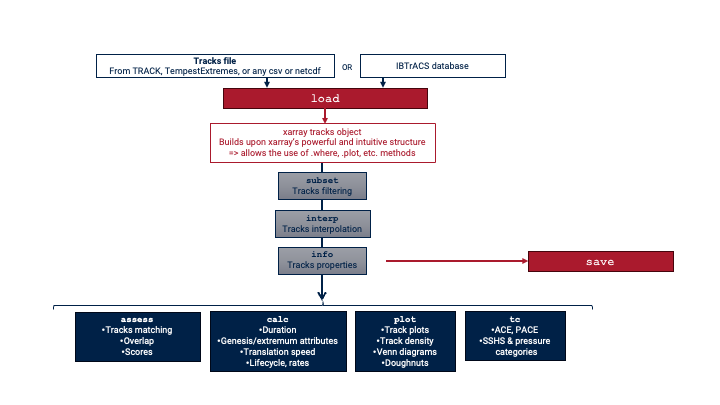

# User Guide

```{toctree}
---
maxdepth: 4
hidden:
---
self
install
quickstart
accessor
demo
load
save
subset
units
```

This User Guide is here to help you use HuracanPy, by providing explanations about the most important aspects of the packages.
We recommend you read through the pages in the provided order if you are starting, but each of them can also be read as standalone for future reference.

HuracanPy provides a standard way for working with cyclone track data from different sources and has several modules that allow you to:
- Load, subset, interpolate, and save cyclone tracks ([huracanpy](../api/huracanpy.rst));
- Add information to your tracks ([huracanpy.info](../api/info.rst));
- Compute standard diagnostic metrics ([huracanpy.calc](../api/calc.rst));
- Compute tropical-cyclone specific metrics ([huracanpy.tc](../api/tc.rst));
- Make simple plots ([huracanpy.plot](../api/plot.rst));
- Compare several datasets between them ([huracanpy.assess](../api/assess.rst)).

The flowchart below illustrates this structure. The functions in each module are listed in the ([API](../api/index.rst)).


