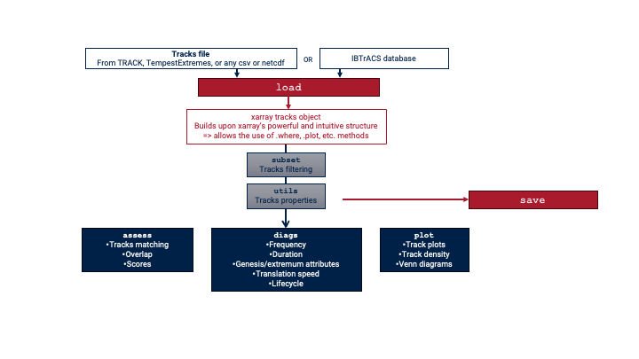

==========
User Guide
==========

Pre-requisites
--------------

xarray
~~~~~~

Our package is designed to load track data as xarray objects. 
We recommend you get familiar with xarray to make the most of this package (https://tutorial.xarray.dev/intro.html). 

Package structure
-----------------

The package has several modules that allow you to:

* Load  and save cyclone tracks;
* Subset and interpolate the tracks;
* Add information to your tracks (:ref:`api-info`);
* Compute standard diagnostic metrics (:ref:`api-calc`);
* Make simple plots (:ref:`api-plot`);
* Compare several datasets between them (:ref:`api-assess`).

It also module containing TC-specific functions (:ref:`api-tc`). 

The flowchart below illustrates this structure. The functions in each module are listed in the :ref:`api-index`.

xarray accessor
~~~~~~~~~~~~~~~

The package also defines a `.hrcn` xarray accessor, which allow you to call most of the functions as methods on the dataset itself. 

.. toctree::
    :maxdepth: 4
    :hidden:

    self
    install
    quickstart
    demo
    load
    save
    subset
..  hidden at the moment
    speed